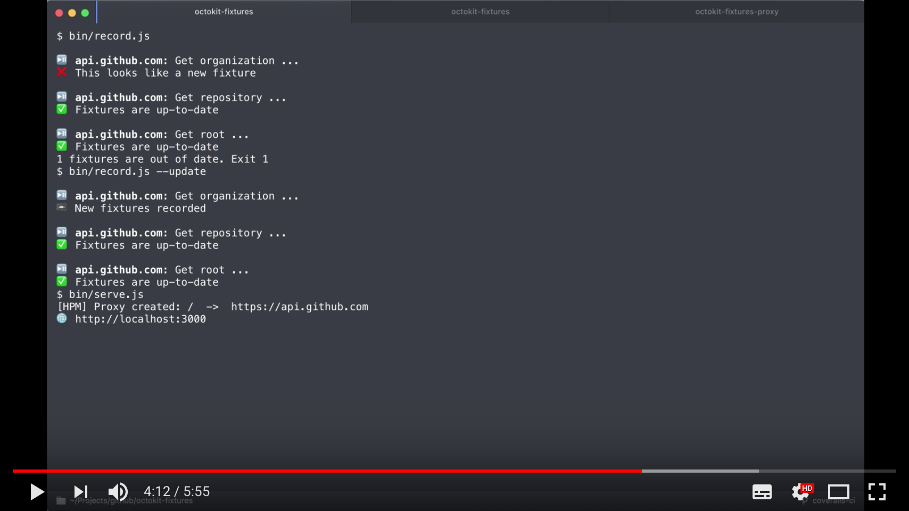

# How it works

* [Recording](#recording)
* [Updating fixtures](#updating-fixtures)
* [Creating new fixtures](#creating-fixtures)
* [Automated pull requests when API change](#automated-pull-requests-when-api-change)
* [Normalizations](#normalizations)
* [Cron job](#cron-job)

[](https://youtu.be/L851arJSMhM)

`@octokit/fixtures` provides fixtures that can be used by automated tests for
GitHub API clients.

The fixtures are recorded programatically
by sending requests against the [GitHub REST API](https://developer.github.com/v3/)
and recording both requests and responses into JSON files. Each scenario has their own folder in the [scenarios/<host>/ folder](scenarios/)). Each of these folders contains 4 files:

- **`test.js`**  
  an integration test as an example for consumers
- **`record.js`** <a name="record-js-file"></a>  
  exports one of the following

  - [axios request config](https://www.npmjs.com/package/axios#request-config)
  - an array of axios request configs
  - a function that returns a Promise

  To keep requests from being captured as fixture (e.g. to create/delete a
  temporary request), set the request Header `X-Octokit-Fixture-Ignore` to `'true'`.
- **`raw-fixture.json`**  
  The raw request and response before normalization, which is used for integration tests and debugging. Only sensitive credentials are removed
- **`normalized-fixture`** <a name="normalized-fixture-file"></a>    
  The result of the recorded fixtures after normalization.

## Recording

The [record task](CONTRIBUTING.md#record) [normalizes](#normalizations) requests and responses
before storing them in order to remove changing values like time stamps and counts.
Afterwards the new fixtures are compared to the existing ones. If a change occurs,
an error is logged.

## Updating fixtures

The stored fixtures can be updated by running `bin/record.js --update`. Both
the normalized and raw fixtures will be updated.

## Creating fixtures

To create a new scenario, follow the steps below which describe the process
for the example to create a new scenario "Get repository" for GitHub’s public
api at https://api.github.com, make sure to adapt it for your own scenario.


1. Create the folder `scenarios/api.github.com/get-repository/`. In that folder,
   create a [`record.js`](#record-js-file) file.

2. Run `bin/record.js api.github.com/get-repository`. It should log the following
   ```
   ⏯  api.github.com: Get repository ...
   ❌  This looks like a new fixture
   ```
3. If there are no other changes, you can create the new fixtures by
   running `bin/record.js --update api.github.com/get-repository`. Now it should log
   ```
   ⏯  api.github.com: Get repository ...
   📼  New fixtures recorded
   ```
4. Look into the created [`normalized-fixture.json`](#normalized-fixture-file) file
   and make sure all content is normalized correctly (see [Normalizations](#normalizations) below).
   Adapt the file as needed.
5. Run `TAP_GREP="normalize api.github.com/get-repository" ./node_modules/.bin/tap test/integration/normalize-test.js`
   (replace `api.github.com/get-repository` with the folder of your new scenario).
   It will fail and show the changes between your `normalized-fixture.json` file
   and the one that got calculated. Look into the [`lib/normalize` folder](lib/normalize)
   and make the necessary changes. Repeat until the test passes
6. Run `bin/record.js`, it should result with "Fixtures are up-to-date".
   If not, repeat the previous step until it does
7. Commit all changes with `feat(scenario): get repository`
8. Create a pull request

## Automated pull requests when API change

In order to keep the fixtures up-to-date with GitHub’s and GitHub Enterprise’s
APIs, the record task is run daily utilizing GitHub Actions.
If a change in the fixtures occurs, a pull request is opened (or updated) in
order to notify the maintainers who can then release a new breaking version
of the `@octokit/fixtures` package and notify developers of the update.

## Normalizations

- **All IDs are set to 1000** or above. The ID increments for each entity of the
  same type within the same scenario
- **All Node IDs are set to `MDA6RW50aXR5MQ==`** which is the base64 string for `00:Entity1`.
- **Tokens Authorization Header are zerofied** ending with the token number, see [environment variables below](CONTRIBUTING.md#test-users--organization--tokens)  
  e.g. `FIXTURES_USER_A_TOKEN_FULL_ACCESS` becomes `0000000000000000000000000000000000000001`,
  `FIXTURES_USER_B_TOKEN_FULL_ACCESS` becomes `0000000000000000000000000000000000000002`, etc
- **All timestamps are set to the time of the GitHub Universe 2017 keynote**  
  Dates are set in different formats, so here are a few examples
  - UTC in seconds: `2017-10-10T16:00:00Z` (e.g. `updated_at`)
  - UTC with Timezone Delta: `2017-10-10T09:00:00-07:00` (e.g. invitation `created_at`)
  - GMT date string: `Tue, 10 Oct 2017 16:00:00 GMT` (e.g. `Last-Modified` header)
  - UNIX timestamp in seconds: `1507651200000` (e.g. `X-RateLimit-Reset` header)
- **All counts are set to 42**  
  for example: `forks_count`, `open_issues_count`
- **Rate limits**
  - for unauthenticated requests, `X-RateLimit-Remaining` is set to `59`.
  - for authenticated requests, `X-RateLimit-Remaining` is set to `4999`.
- **Random things**  
  Fill random headers like `ETag` or `X-GitHub-Request-Id` and auth tokens with 0s.
- **Content-Length** header is re-calculated after normalization of the response body
- **URLs containing temporary repository names** in response properties, paths
  and location header are renamed,
  e.g. `tmp-scenario-create-file-20170930034241803` is renamed to `create-file`.
- **Commit sha hashes** are zerofied with a counter,
  e.g. `3f3f005b29247e51a4f4d6b8ce07b67646cd6074` becomes `0000000000000000000000000000000000000001`,
  the next unique commit sha becomes `0000000000000000000000000000000000000002`, etc.
- **GitHub Request IDs** are zerofied,
  e.g. `DDA3:292D9:5B9AC0:62137E:5A022DD0` becomes `0000:00000:0000000:0000000:00000000`

## Cron job

Changes to GitHub’s API are automatically detected using a daily cron job which
runs on GitHub ACtions. If changes are detected, the cron job creates a pull request
([example](https://github.com/octokit/fixtures/pull/61)).
